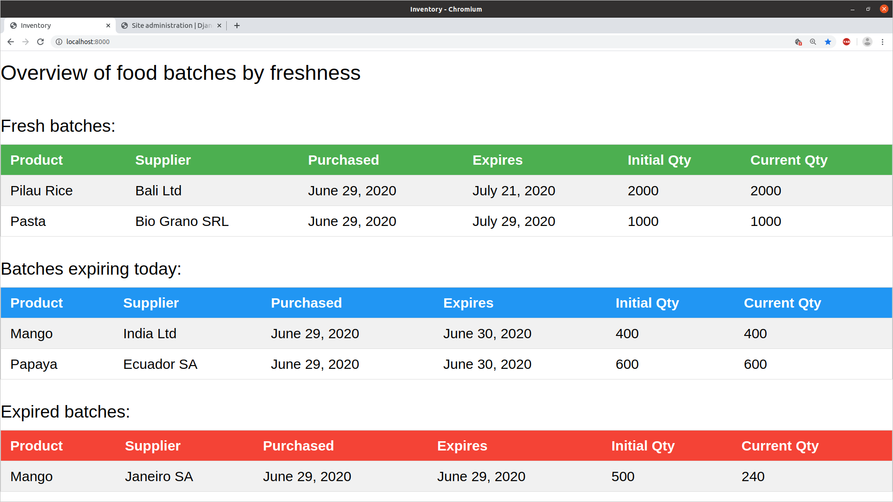

# Inventory management system

## Assumptions

1. The present setup is for a development/test environment only
 **It must not be deployed to a production environment.**
*In such case we'd use a different database (I suggest PostreSQL) and web server (Apache or uvcorn) combined with a reverse proxy (Nginx)*

2. A batch contains N items of the same product, e.g. 1000 packets of rice

## Setup and execution of the tests

`docker build --no-cache --target pybuild -t testbuild .`

`docker run -it testbuild`

## Setup and execution of the backend

Go to the root `feltest` directory and build the docker image

`docker build -t appbuild .`

Launch it

`docker run -it -p 8000:8000 appbuild`

## Access to the REST API

- the root of the API is

	http://localhost:8000/inventory/api/v1.0/

- the available endpoints are

	http://localhost:8000/inventory/api/v1.0/products/
	http://localhost:8000/inventory/api/v1.0/products/<id>
	http://localhost:8000/inventory/api/v1.0/batches/
	http://localhost:8000/inventory/api/v1.0/batches/overview
	http://localhost:8000/inventory/api/v1.0/batches/<id>
	http://localhost:8000/inventory/api/v1.0/batches/<id>/history

- the  REST API documentation is generated automatically by visiting the endpoints via the browser, e.g.

	http://localhost:8000/inventory/api/v1.0/products/

## Access to frontend

- the web interface is limited to the overview
http://localhost:8000/

## Django admin dashboard

	http://localhost:8000/admin/

## Data model

Product:

- name
- weight

Batch:

- product (fk to Product)  # which product
- supplier  # (it could be a fk on Supplier, not modelled now)
- pur_date  # purchased on
- exp_date  # expires on
- init_qty  # initial quantity
- curr_qty  # current quantity
- tot_cost  # paid for the batch

Events:

- batch (fk to Batch)  # to which batch it refers
- ev_date  # when it occurred
- ev_type  # QTY, etc.
- ev_info  # Further info about the event, e.g. qty variation

## Improving performance

### Scaling

- Deploy multiple instances of the microservice, even if sharing a
common DB instance, e.g. use PostgreSQL.

### Performance

The code spends time in:

Database lookup 0.0090s (65.7%)
Serialization 0.0025s (18.2%)
Django request/response 0.0015s (10.9%)
API view 0.0005s (3.6%)
Response rendering 0.0002s (1.5%)
Total 0.0137s

Possible actions:

- Cache DB lookup, e.g. with Redis
- Remove serialization where unnecessary (e.g. use qs.values() instead)
- Remove unnecessary middleware
- Make the view slimmer
- Use basic HTTPResponse

See https://www.dabapps.com/blog/api-performance-profiling-django-rest-framework/

### Technical debt

1. Use a custom model manager to create batch events instead of doing it in the view (when the batch is updated/patched)
